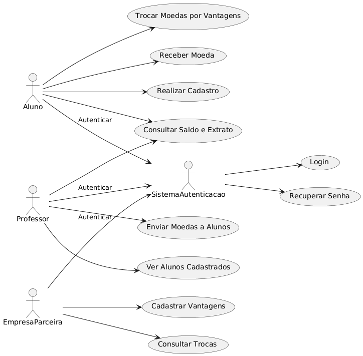
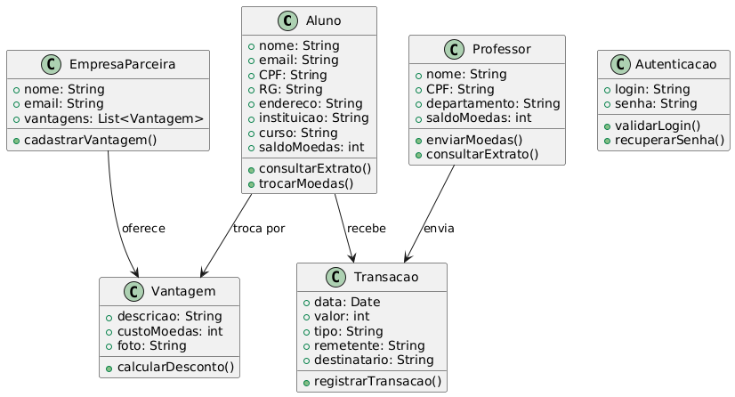
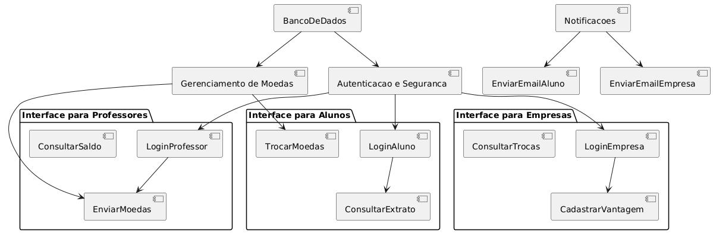

<h1 align="center">
      Sprint 01
</h1>

## Histórias de Usuários

### Aluno:

Como aluno, desejo me cadastrar no sistema para poder acumular moedas.
Como aluno, quero consultar meu saldo para saber quantas moedas tenho disponíveis.
Como aluno, desejo trocar minhas moedas por descontos e produtos das empresas parceiras.

### Professor:

Como professor, quero enviar moedas para meus alunos para reconhecer seu desempenho.
Como professor, quero visualizar o saldo de moedas restantes para controlar minhas distribuições.

### Empresa Parceira:

Como empresa parceira, desejo cadastrar produtos e vantagens para que os alunos possam trocar suas moedas.
Como empresa parceira, desejo ser notificada por email quando um aluno realizar uma troca.

## Diagramas

### Diagrama de Caso de Uso

### Diagrama de Classes

### Diagrama de Componentes

